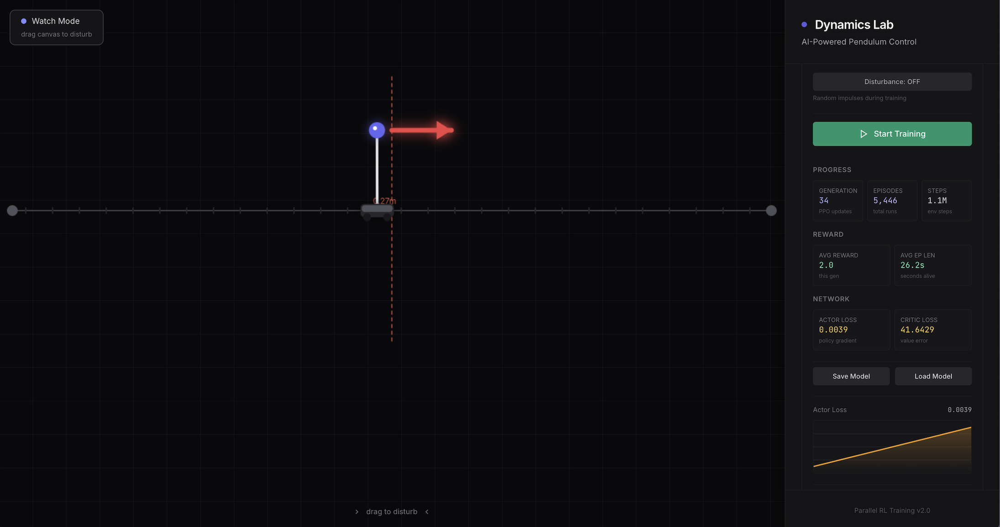

# Pendulum — PPO Reinforcement Learning

A real-time pendulum balancing system trained with Proximal Policy Optimization (PPO). Watch a neural network learn to swing up and balance a cart-pole from scratch, right in your browser.

---




---

## How it works

- **Backend** (`train.py`) — runs a PPO training loop across 16 parallel physics environments simultaneously. A shared neural network (actor-critic, 2 hidden layers of 128 units) is updated every generation using minibatch gradient descent.
- **Frontend** (`index.html`) — renders the live simulation at 50fps using canvas. Connects to the backend via WebSocket to display real-time training stats and the agent's current behaviour.
- **Physics** — 1.5m arm cart-pole with Verlet-constraint simulation in the browser and a matching analytical model in the trainer.

### Modes

| Mode | Description |
|---|---|
| **Manual** | No server model loaded. Use arrow keys or mobile buttons to drive the cart yourself. |
| **Training Active** | 16 parallel envs training in the background. Canvas shows the latest policy in real-time. |
| **Watch Mode** | Load a saved model. Training stops. Drag the canvas left/right to disturb the agent and watch it recover. |

### What the stats mean

| Stat | Meaning |
|---|---|
| Generation | Number of PPO update cycles. Each = 32,768 env steps (2048 × 16 envs). |
| Episodes | Total completed runs (falls + timeouts) across all envs and generations. |
| Steps | Raw total environment interactions. |
| Avg Ep Len | Average time in seconds an episode lasted. Goes up as the agent improves. |
| Actor Loss | Policy gradient loss — how much the policy changed this update. |
| Critic Loss | How wrong the value estimator was. Should decrease over time. |
| Upright % | % of steps where the pole is within 15° of vertical. |
| Centered % | % of steps where the cart is within 0.5m of center. |
| Perfect % | Both upright and centered simultaneously — the key metric. |

---

## Setup

**Requirements:** Python 3.10+, pip

```bash
cd pendulum
pip install -r requirements.txt
python train.py
```

Then open `index.html` in your browser (just double-click it or use a local server). The frontend auto-connects to `ws://localhost:8765`.
